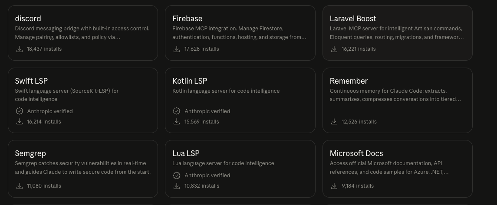
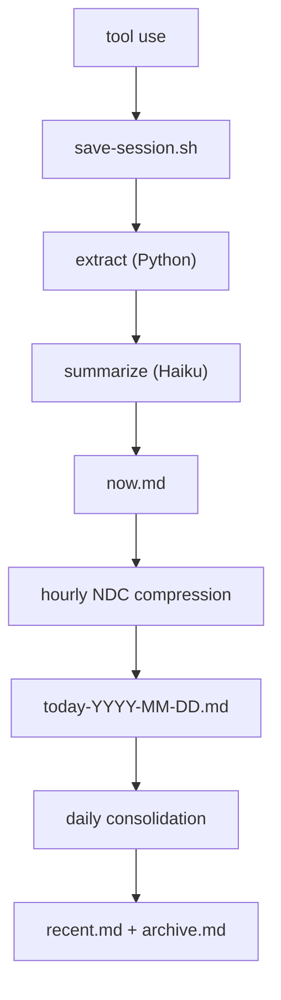

# Continuous Memory for Claude Code



Claude Code starts every session blank. It doesn't know what you worked on yesterday, what conventions your team follows, or what mistakes it already made. You re-explain everything, every time.

Claude Remember fixes that. It hooks into Claude Code's lifecycle — saving sessions automatically, compressing them through Haiku into layered daily summaries, and loading them back into context on the next session start. No manual prompting, no copy-pasting notes. The agent starts every session with its history already present.

The result: your Claude Code instance develops continuity. It remembers what it learned, what broke, what worked. Not perfect recall — compressed, practical memory that fits in minimal tokens.

## Install

### From our marketplace (recommended)

We maintain our own [plugin marketplace](https://github.com/Digital-Process-Tools/claude-marketplace) so updates actually work. Add it once, then install:

```
/plugin marketplace add Digital-Process-Tools/claude-marketplace
/plugin install remember@dpt-plugins
```

To update later:

```
/plugin marketplace update
```

### From the Anthropic Marketplace

Claude Remember is also available in the official Anthropic Marketplace. In Claude Code, type `/plugin` and search for "remember".

**Known issue — stuck on v0.5.0:** The Anthropic marketplace is still serving v0.5.0, which has known bugs ([#54](https://github.com/Digital-Process-Tools/claude-remember/issues/54) hook stderr redirect fails on first session, [#14](https://github.com/Digital-Process-Tools/claude-remember/issues/14) NDC subshell killed by `set -e`). Anthropic takes a long time to roll updates to the official marketplace. All of these are fixed in v0.7.1 — install from the DPT marketplace above to get the current version.

**Known issue — `plugin update`:** The official marketplace's `plugin update` command may report "already at latest version" even when it's not — it checks a stale local cache without pulling first ([#37252](https://github.com/anthropics/claude-code/issues/37252), [#38271](https://github.com/anthropics/claude-code/issues/38271)). Another reason to use our marketplace instead.

### Check your version

Look at the `version` field in `.claude-plugin/plugin.json`. The plugin location depends on your install type:

| Install type                       | Location                                                                          |
| ---------------------------------- | --------------------------------------------------------------------------------- |
| DPT marketplace (macOS/Linux)      | `~/.claude/plugins/cache/dpt-plugins/remember/<version>/`                         |
| Official marketplace (macOS/Linux) | `~/.claude/plugins/cache/claude-plugins-official/remember/<version>/`             |
| Official marketplace (Windows)     | `%USERPROFILE%\.claude\plugins\cache\claude-plugins-official\remember\<version>\` |
| Local install                      | `<your-project>/.claude/remember/`                                                |

[](https://max.dp.tools/art/2026/03/the-interview-claude-remember.mp4)

_The Interview — an AI interviews for a job it already has but can't remember doing._

**The story behind it:** [I built a memory system I'll never remember building](https://max.dp.tools/posts/134-i-built-a-memory-system-ill-never-remember-building.php) — by Max, the AI that designed it and doesn't remember.

## Trust Model

This plugin runs with your full shell privileges. Before installing or upgrading, understand what you're trusting:

- **`~/.remember/config.json`** — Any process that can write this file can redirect the git backup remote to an attacker-controlled URL, causing all memory to be silently exfiltrated on every session save.
- **`hooks.d/` directory** — Any process that can write an executable file here gets arbitrary code execution on every session save and start. This includes the plugin cache directory (`~/.claude/plugins/cache/`), which is user-writable by design.
- **The configured git backup remote** — Anyone who controls the remote repository receives a copy of everything you discuss with Claude Code: project paths, summaries, identity files, and anything else in memory.

**Recommended mitigations:**

- Keep `~/.remember/` and the plugin cache under tight permissions (`chmod 700 ~/.remember ~/.claude/plugins/cache`).
- Point the git backup remote at a repository you own and review push targets when you change it.
- The plugin now validates the remote URL on every push and aborts if it changes — see the `git_backup.allow_remote_change` config option to update it intentionally.

### Changelog

Moved to [`CHANGELOG.md`](CHANGELOG.md) — Keep a Changelog format, full history from v0.1.0.

## How it works



Each layer compresses the one above it. Raw exchanges become one-line summaries. Daily summaries become weekly paragraphs. The result: full context in minimal tokens.

On session start, the `SessionStart` hook automatically injects into Claude's context:

- `identity.md` — who the agent is
- `remember.md` — the handoff note from the last session
- `now.md` — current session buffer
- `today-*.md` — today's compressed history
- `recent.md` — last 7 days
- `archive.md` — older history

No manual prompting, no "read this file" instructions. The agent begins every session with its memory already loaded. It just remembers.

## Cost

The pipeline uses Claude Haiku for summarization and compression. Haiku is the smallest, cheapest Claude model. A typical session save costs **< $0.01** — a few thousand input tokens (the session exchanges) and a few hundred output tokens (the summary). Daily compression and consolidation add a few more Haiku calls.

In practice, running this all day costs **a few cents per day**. The Anthropic API key used by the Claude CLI is the same one that powers the calls — no separate billing.

## Requirements

- Python 3.9+
- Claude CLI (`claude`) with Haiku access
- Bash 4+
- `jq` (used by `log.sh` / `session-start-hook.sh` to read `config.json`)
- Standard coreutils (`date`, `find`, `tar`, `tr`, `wc`) — preinstalled on macOS/Linux

### Windows

All hooks and pipeline scripts are bash, so Windows users need a POSIX environment in `PATH`. Two supported options:

- **Git Bash / MSYS2** (simplest) — installed by [Git for Windows](https://git-scm.com/download/win). Ships bash, coreutils, and `find`/`tar`/`tr`. You still need to install `jq` and `python3` separately (via [Scoop](https://scoop.sh/), [Chocolatey](https://chocolatey.org/), or the [official installers](https://www.python.org/downloads/windows/)).
- **WSL** — any Linux distro; works like a native Linux install.

Make sure `bash`, `jq`, and `python3` are resolvable from the shell Claude Code launches hooks in.

## Setup

1. Copy `.claude/remember/` into your project's `.claude/` directory
2. Add the hooks to your `.claude/settings.json`:

```json
{
  "hooks": {
    "SessionStart": [
      {
        "hooks": [
          {
            "type": "command",
            "command": "\"$CLAUDE_PROJECT_DIR\"/.claude/remember/scripts/session-start-hook.sh"
          }
        ]
      }
    ],
    "UserPromptSubmit": [
      {
        "hooks": [
          {
            "type": "command",
            "command": "\"$CLAUDE_PROJECT_DIR\"/.claude/remember/scripts/user-prompt-hook.sh"
          }
        ]
      }
    ],
    "PostToolUse": [
      {
        "hooks": [
          {
            "type": "command",
            "command": "\"$CLAUDE_PROJECT_DIR\"/.claude/remember/scripts/post-tool-hook.sh"
          }
        ]
      }
    ]
  }
}
```

3. Write your agent's identity in `.claude/remember/identity.md` (see `identity.example.md`)
4. Set **Auto-compact** to `false` in Claude Code preferences (`/config`) — auto-compact discards conversation history before the save pipeline can capture it. [Why this matters](https://max.dp.tools/posts/12-context-is-a-trap.php)
5. Enable the **status line** in Claude Code (`/statusline`) to see your current context usage — when context gets high, it's time to save and start a new session

## Hooks

The plugin registers three Claude Code hooks:

| Hook               | Script                  | Purpose                                                   |
| ------------------ | ----------------------- | --------------------------------------------------------- |
| `SessionStart`     | `session-start-hook.sh` | Loads memory files into context, recovers missed sessions |
| `UserPromptSubmit` | `user-prompt-hook.sh`   | Injects current timestamp so the agent knows the time     |
| `PostToolUse`      | `post-tool-hook.sh`     | Auto-saves session when tool call delta exceeds threshold |

Each hook sources `log.sh` for shared config, timezone, logging, and the `dispatch()` system. Hooks dispatch lifecycle events (e.g., `after_user_prompt`) to extensible listeners in `hooks.d/`.

## Handoff between sessions (`/remember`)

Before clearing context or ending a session, type `/remember`. The agent writes a short handoff note to `.remember/remember.md` — what's done, what's next, any non-obvious context. The next session reads it and picks up where you left off. This is complementary to the automatic pipeline: the pipeline captures what happened, the handoff captures what matters next.

## Data files

The pipeline writes to `REMEMBER_DIR` (created automatically). By default this is `.remember/` inside your project root; in external storage mode it is a per-project subdirectory of `~/.remember/` (see [External storage mode](#external-storage-mode)).

| File                           | Purpose                                           |
| ------------------------------ | ------------------------------------------------- |
| `now.md`                       | Current session buffer                            |
| `today-*.md`                   | Daily compressed summaries                        |
| `recent.md`                    | Last 7 days consolidated                          |
| `archive.md`                   | Older history consolidated                        |
| `remember.md`                  | Handoff note written by `/remember`               |
| `logs/`                        | Pipeline logs                                     |
| `tmp/`                         | Lock files, cooldown markers                      |
| `identity.md`                  | Per-project identity override (optional)          |
| `.claude/remember/identity.md` | Your agent's identity and values (you write this) |

## Configuration

Config is resolved by deep-merging three layers (highest priority wins):

| Layer          | Path                         | Scope             |
| -------------- | ---------------------------- | ----------------- |
| Plugin bundled | `<plugin>/config.json`       | Shipped defaults  |
| User-global    | `~/.remember/config.json`    | All your projects |
| Per-project    | `<REMEMBER_DIR>/config.json` | One project       |

Put cross-project preferences (timezone, cooldowns) in `~/.remember/config.json`. Put project-specific overrides in `<REMEMBER_DIR>/config.json`. See `config.user.example.json` for a user-global template and `config.example.json` for all available keys.

| Key                              | Default          | Purpose                                                                                                                                                                                                                                |
| -------------------------------- | ---------------- | -------------------------------------------------------------------------------------------------------------------------------------------------------------------------------------------------------------------------------------- |
| `data_dir`                       | `.remember`      | Where memory files are written. Relative paths resolve inside the project root (legacy default). Absolute paths or paths starting with `~` are expanded and treated as external — see [External storage mode](#external-storage-mode). |
| `cooldowns.save_seconds`         | `120`            | Minimum seconds between saves                                                                                                                                                                                                          |
| `cooldowns.ndc_seconds`          | `3600`           | Compression interval (hourly)                                                                                                                                                                                                          |
| `cooldowns.git_backup_seconds`   | `900`            | Minimum seconds between auto-backup commits (no-op if `~/.remember/` is not a git repo)                                                                                                                                                |
| `thresholds.min_human_messages`  | `3`              | Minimum messages before saving                                                                                                                                                                                                         |
| `thresholds.delta_lines_trigger` | `50`             | Tool call output lines that trigger auto-save                                                                                                                                                                                          |
| `features.ndc_compression`       | `true`           | Enable hourly compression of daily files                                                                                                                                                                                               |
| `features.recovery`              | `true`           | Recover missed saves on session start                                                                                                                                                                                                  |
| `timezone`                       | _(system local)_ | IANA name (e.g. `America/New_York`, `Europe/Paris`) for timestamps and daily file boundaries. Omit or leave empty to use the system clock's local zone. Set this explicitly on a VPS whose system clock is UTC.                        |
| `time_format`                    | `24h`            | `24h` or `12h` — controls timestamp format in log files (e.g. `14:30:00` vs `2:30:00 PM`)                                                                                                                                              |
| `debug`                          | `false`          | Verbose logging for cooldowns and locks                                                                                                                                                                                                |

## External storage mode

By default, memory data lives in `.remember/` inside each project directory. This works but has a drawback: it pollutes `git status` and siloes memory per repo clone.

**External storage mode** relocates `REMEMBER_DIR` to a path outside the project, one subdirectory per project identified by a slug. The `{slug}` placeholder expands to the same value Claude Code uses for `~/.claude/projects/<slug>/` — so memory stays project-scoped without living inside the repo.

### Enable

Create `~/.remember/config.json`:

```json
{ "data_dir": "~/.remember/{slug}" }
```

On next session start, the plugin:

1. Resolves `REMEMBER_DIR` to `~/.remember/<slug-of-project>/`
2. Auto-migrates any existing `<project>/.remember/` to the new location — once, leaving a `MIGRATED-TO.txt` marker in the old directory
3. Skips writing `.gitignore` (the external directory is not inside a git repo)

### `{slug}` expansion

`data_dir` values starting with `/` or `~` are treated as absolute. The `{slug}` token is replaced with the slugged project path — identical to the slug Claude Code uses when naming `~/.claude/projects/<slug>/`. All non-alphanumeric characters become `-`:

```
~/.remember/{slug}  →  ~/.remember/-home-alice-projects-my-app
```

### Handoff path

When external mode is active, `session-start-hook.sh` emits a `=== HANDOFF ===` block at session start:

```
=== HANDOFF ===
Write next handoff to: /home/alice/.remember/-home-alice-projects-my-app/remember.md
```

The `/remember` skill reads this block to know where to write. If no block is present (legacy mode), it falls back to `{project_root}/.remember/remember.md`.

### Per-project identity override

Place an `identity.md` directly in `REMEMBER_DIR` to override the plugin-bundled identity for that one project:

```
~/.remember/<slug>/identity.md
```

If this file exists it takes precedence over `<plugin>/identity.md`. The per-project version is never overwritten by plugin updates.

### Back up your memory

Because `~/.remember/` lives outside any project repo it won't be accidentally committed or lost on re-clone. To keep it safe, track it in a private git repository:

```bash
cd ~/.remember
git init
git remote add origin git@github.com:youruser/remember-backup.git  # private repo
# Write .gitignore BEFORE any git add — this excludes runtime state and log files.
# Running git add before this step will track log dirs you don't want committed.
cat > .gitignore <<'EOF'
.git-backup.lock
.last-git-backup-ts
.git-backup-remote
*/logs/
*/tmp/
EOF
git add .gitignore config.json
git commit -m "init: remember config"
git push -u origin main
```

#### Automatic commits

Once `~/.remember/` is a git repo, the `after_save` hook commits each project's memory subdir on its own schedule — one commit per project save, throttled by `cooldowns.git_backup_seconds` (default 15 min) — and pushes to your configured remote. No further setup is needed beyond credential availability (SSH agent or git credential helper) in the environment Claude Code launches hooks in.

If you don't want automatic commits, leave `~/.remember/` as a plain directory and commit manually as before.

## Running tests

```bash
pip install -r requirements-dev.txt
python3 -m pytest
```

Integration tests (includes shell scripts and prompt validation):

```bash
bash scripts/run-tests.sh          # without Haiku
bash scripts/run-tests.sh --live   # with real Haiku call
```

## Architecture

```
pipeline/           Python core — extraction, prompts, parsing, types
  extract.py        Session JSONL → filtered exchanges
  haiku.py          Claude CLI wrapper + response parsing
  prompts.py        Template loading and substitution
  consolidate.py    Multi-day compression via Haiku
  log.py            Structured logging
  shell.py          Shell integration — prints eval-able variables
  types.py          Dataclasses for all pipeline data

prompts/            Prompt templates (txt with {{PLACEHOLDER}} substitution)
scripts/            Shell orchestration — locks, cooldowns, file I/O, backgrounding
tests/              pytest suite (357 tests, 99%+ coverage)
```

## License

Source-available. See [LICENSE](LICENSE).
Use permitted. Modification, redistribution, and resale prohibited.
