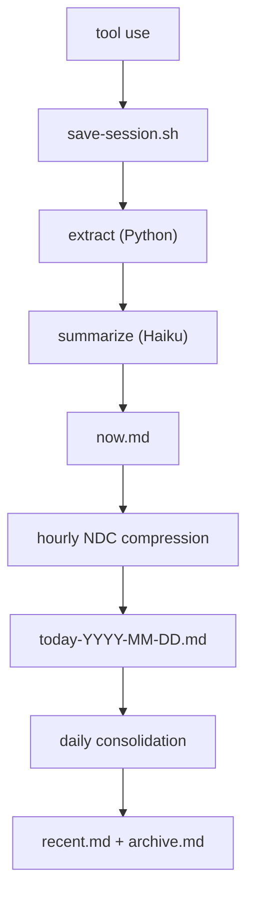

# Continuous Memory for Claude Code


[](https://github.com/Digital-Process-Tools/claude-remember/actions/workflows/tests.yml)
[](https://www.python.org/)
[](https://github.com/Digital-Process-Tools/claude-remember/actions/workflows/tests.yml)
[](LICENSE)
[](.claude-plugin/plugin.json)

**The "Windows" in the badge above is honest about the platform, not about the coverage** ([#497](https://github.com/Digital-Process-Tools/claude-remember/issues/497)): most of the suite still blanket-skips on `win32` rather than actually running there, and the `windows-latest` legs report `success` either way. [Running tests](docs/running-tests.md) says exactly how much, and every `pytest` run — including the CI leg itself — now prints the live skip ratio rather than leaving it silent.

Claude Code starts every session blank. It doesn't know what you worked on yesterday, what conventions your team follows, or what mistakes it already made. You re-explain everything, every time.

Claude Remember fixes that. It hooks into Claude Code's lifecycle — saving sessions automatically, compressing them through Haiku into layered daily summaries, and loading them back into context on the next session start. No manual prompting, no copy-pasting notes. The agent starts every session with its history already present.

The result: your Claude Code instance develops continuity. It remembers what it learned, what broke, what worked. Not perfect recall — compressed, practical memory that fits in minimal tokens.

## From the same workshop

Four plugins, one team, each does one thing. This one and three siblings:

- [claude-jit-context](https://github.com/Digital-Process-Tools/claude-jit-context): project knowledge that loads only when the prompt, the file or the tool matches it.
- [claude-supertool](https://github.com/Digital-Process-Tools/claude-supertool): batched file and tracker ops. One call instead of seven, and a refusal instead of a wrong answer.
- [claude-oss](https://github.com/Digital-Process-Tools/claude-oss): the maintainer loop that runs these four repos. Triage, build, review, merge, release.

All four install from one marketplace: `/plugin marketplace add Digital-Process-Tools/claude-marketplace`.

## Install

### From our marketplace (recommended)

We maintain our own [plugin marketplace](https://github.com/Digital-Process-Tools/claude-marketplace) so updates actually work. Add it once, then install:

```
/plugin marketplace add Digital-Process-Tools/claude-marketplace
/plugin install remember@dpt-plugins
```

To update later:

```
/plugin marketplace update
```

**Restart Claude Code after installing or enabling.** Claude Code reads hook registrations when a session starts, so a plugin enabled part-way through one has no hooks wired for the rest of it — `PostToolUse` never fires and nothing is captured, with no error anywhere ([#200](https://github.com/Digital-Process-Tools/claude-remember/issues/200)). Nothing inside a hook can detect this while it is happening, so the plugin reports it at the *next* session start instead. If capture seems to be doing nothing, run `/remember:doctor`.

### From the Anthropic Marketplace

Claude Remember is also available in the official Anthropic Marketplace. In Claude Code, type `/plugin` and search for "remember".

**Releases reach this route on the catalogue's schedule, not ours, and that schedule is not predictable from ours.** `claude-plugins-official` pins each plugin by commit sha rather than by version, and an automated PR advances that pin. Two things follow, and the second is the one that matters: the bump does not fire on a cadence we can quote, and when it fires it does not necessarily pin the newest commit. The lag is unbounded, not something our own release cadence lets you predict, and it has been observed skipping more than one tagged release in a row -- not just one.

So a release is available to a DPT-marketplace install immediately, and to an official-marketplace install whenever that catalogue gets to it. We are not going to put a number on the delay; we had one here for a day and it was already wrong the day after. Measure your own exposure instead:

```
gh api repos/anthropics/claude-plugins-official/contents/.claude-plugin/marketplace.json --jq '.content' | base64 -d | grep -A6 '"name": "remember"'
git log -1 --format='%h %ad %s' --date=short <sha>
```

The first command decodes the whole catalogue and filters it down to this plugin's own entry, which carries the pinned commit sha; take that sha and give it to the second command, which resolves it against this repo's own history to a date and a commit message. Three outcomes, and only the last two mean the catalogue is behind: the pin resolves to the commit for the release you already expect (current); the pin resolves to an older commit, and the date is your lag (behind, by however long the second command says); or either command fails, or the `grep` finds no `remember` entry at all (the pin could not be read -- treat that as unknown, not as current).

**`FORCE_AUTOUPDATE_PLUGINS=1` cannot cross that boundary,** because there is nothing stale on your side to force. Against a catalogue pinned behind the current release, `claude plugin update remember@claude-plugins-official` correctly reports the plugin as already current at the pinned version. The CLI is right and the input is old ([#264](https://github.com/Digital-Process-Tools/claude-remember/issues/264)). Waiting for the next bump works; installing from the DPT marketplace above skips the wait.

**Separately, `plugin update` can report "already at latest version" from a stale local cache** without pulling first ([#37252](https://github.com/anthropics/claude-code/issues/37252), [#38271](https://github.com/anthropics/claude-code/issues/38271)). That one is a client-side cache and is a different failure from the pin lag above, though both surface the same sentence.

### Codex (verified against a live install)

This repo ships a declarative Codex layer -- `.codex-plugin/plugin.json`, a self-referential marketplace entry at `.agents/plugins/marketplace.json`, and `hooks/hooks.codex.json`, which binds Codex's lifecycle events to the same `scripts/*.sh` Claude Code already uses ([#410](https://github.com/Digital-Process-Tools/claude-remember/issues/410)). No new hook code was written for it. Install it with:

```
codex plugin marketplace add Digital-Process-Tools/claude-remember
codex plugin install remember
```

The Codex-side manifest is a *second* file, `hooks/hooks.codex.json`, rather than a shared one -- Codex's default convention would otherwise point at the exact same `hooks/hooks.json` path Claude Code's manifest already uses by its own default, and the two hosts' hook shapes are close but not identical (Codex hooks support fields, like `matcher` and `timeout`, that this repo's Claude-side manifest does not use).

**Observed against `codex-cli 0.150.1` (macOS arm64), not only reasoned from the docs.** Marketplace discovery and `codex plugin install remember` both work as documented; `SessionStart`, `UserPromptSubmit` and `SessionEnd` all fire; `.remember/` is created in the Codex working directory; [#407](https://github.com/Digital-Process-Tools/claude-remember/issues/407)'s session-id-over-basename keying and [#411](https://github.com/Digital-Process-Tools/claude-remember/issues/411)'s stdin-`cwd` fallback for `session-start-hook.sh`/`session-end-hook.sh` both hold up against a real Codex transcript and a real Codex `cwd` payload. `tests/test_codex_manifest_410.py` still only checks the manifests themselves; the live-install claims above are a separate, later observation, not that test suite.

**Extraction itself did not work until [#443](https://github.com/Digital-Process-Tools/claude-remember/issues/443).** Codex writes a different transcript envelope than Claude Code -- every line is `{"timestamp", "ordinal", "type", "payload"}`, with the role and text one level inside `payload` -- and `pipeline/extract.py` originally only recognised Claude Code's shape, so a real Codex session with a real human prompt and a real reply extracted `0 exchanges` and saved nothing, with every outward signal (hooks firing, `.remember/` present) suggesting it had worked. `pipeline/host.py` now sniffs a transcript's envelope from its own first line and reads either shape; an envelope matching neither is reported as `"unrecognised"` rather than silently counted as an empty session. A trimmed, sanitised capture of the reproducing session lives at `tests/fixtures/codex-rollout.jsonl`.

**Per-turn capture failed outright before [#444](https://github.com/Digital-Process-Tools/claude-remember/issues/444)** -- `scripts/user-prompt-hook.sh` and `scripts/post-tool-hook.sh` had no way to resolve `PROJECT_DIR` on a host that never sets `CLAUDE_PROJECT_DIR`, and `|| exit 0`'d silently. Fixed by giving both hooks the same stdin-`cwd` fallback `#411` already gave `session-start-hook.sh`/`session-end-hook.sh`.

**Codex's `UserPromptSubmit` stdout contract is not the same as Claude Code's, and until [#451](https://github.com/Digital-Process-Tools/claude-remember/issues/451)/[#452](https://github.com/Digital-Process-Tools/claude-remember/issues/452) that mismatch marked every prompt on Codex `Failed` regardless of exit code.** Claude Code treats this hook's plain stdout as `additionalContext`, byte for byte -- the two hosts diverge on the way *out*, not the way in. Codex's own hook engine sniffs the first non-whitespace byte of a `UserPromptSubmit` handler's stdout: `{` or `[` means "this claims to be my JSON contract" (`codex-rs/hooks/src/engine/output_parser.rs::looks_like_json`), and a byte that opens with one of those but fails to parse against Codex's own `user-prompt-submit.command.output.schema.json` marks the whole run `HookRunStatus::Failed` -- not because the hook errored, but because Codex tried to read plain text as its own wire format. `scripts/user-prompt-hook.sh` prints `[HH:MM TZ -- user]`, a stamp that opens with `[`, so every prompt on Codex read as failed once #444 made the hook print anything on that host at all. The hook used to branch on whether `CLAUDE_PROJECT_DIR` is set -- Claude Code always sets it, and until #456 this repo assumed Codex and Gemini CLI never do. **That assumption was wrong for Gemini CLI specifically** (settled from documentation, not a live session -- Gemini CLI's own bundled docs list `CLAUDE_PROJECT_DIR` as a compatibility alias it does set, the same name Codex is already known to set), which meant the old gate would have silently routed a Gemini session through Codex's JSON envelope the moment that variable existed -- unverified, since Gemini CLI's own `BeforeAgent` stdout contract has never been observed. **[#534](https://github.com/Digital-Process-Tools/claude-remember/issues/534) fixes the gate itself**, not just the prose: the branch now keys on Codex's own signature, `CODEX_SESSION_ID`/`CODEX_THREAD_ID` (the same pair `pipeline/host.py`'s `CODEX.signature_vars` uses, live-captured in `tests/fixtures/codex-env-463.txt`, #463), so the JSON envelope is Codex-only by construction and every other host -- Gemini included -- gets plain stdout. That is a documented, defensible default (plain stdout is what every already-verified non-Codex host wants, and Codex is the one host whose stdout contract is actually known, from its own schema, to need wrapping), not a claim that plain stdout is what Gemini CLI's `BeforeAgent` contract actually expects -- that stays open, unverified, still blocked on #532. `scripts/session-start-hook.sh` was checked against three store shapes (a full store, a repeated-handoff delivery, an empty store) and does **not** have the same defect -- but the correct claim is about the *first byte of stdout*, matching Codex's own sniffing behaviour, not "every line": the script has exactly one line that opens with `[` (`"[already delivered ... ]"`, printed once the handoff has already been shown), and it is always preceded on the same run by an unconditional `echo "=== LAST HANDOFF ==="`, so the first stdout byte in all three exercised shapes is `=` or a letter, never `{`/`[` (`tests/test_codex_upsubmit_stdout_451.py::test_session_start_first_byte_is_never_bracket_or_brace`). OBSERVED for those three shapes, not proven for every branch of a 1400-line script. Gemini CLI's own stdout contract has not been observed at all, live or otherwise.

**`PostToolUse` does fire, and does carry a usable payload -- but the per-tool-call save it triggers was itself silently rejected until [#468](https://github.com/Digital-Process-Tools/claude-remember/issues/468).** `post-tool-hook.sh` derived the session id it hands `save-session.sh` from the resolved transcript's own basename, which is the session id verbatim on Claude Code but not on Codex (`rollout-<date>-<uuid>.jsonl`) -- so every incremental save on Codex forked `save-session.sh` with an id its own `[a-f0-9-]+` validation gate was always going to reject, into an autonomous log nobody reads. `SessionEnd` was unaffected (it passes the stdin session id directly), which is why a Codex session still looked fully captured end to end: only the *incremental* saves between tool calls were silently lost, and any end that is not a clean `SessionEnd` -- a crash, a kill -- loses the whole session. The hook now prefers the session id it was actually invoked with, falling back to the basename only when nothing usable arrived on stdin, the same precedence `#407` already gave the transcript path.

**Not yet known, rebuilt from what is actually still unknown today (not from what was unknown when this section was first written):** whether `codex resume` behaves correctly once extraction returns a non-zero count; and whether any of this holds on Gemini CLI at all -- everything in this section is OBSERVED against `codex-cli 0.150.1` specifically. The `REMEMBER_HOOK_CWD` fallback no longer needs to be REASONED about for Gemini the way it used to be: Gemini CLI's own bundled docs say it sets `CLAUDE_PROJECT_DIR` directly (#456), so that fallback is expected to go unused on Gemini rather than be load-bearing for it -- still unverified against a live Gemini install (#532), but no longer resting on a belief ("Gemini never sets it") known to be wrong. The stdout envelope is no longer keyed on that belief either (#534): it is Codex-only by construction now, gated on Codex's own live-verified signature (`CODEX_SESSION_ID`/`CODEX_THREAD_ID`), so Gemini gets plain stdout regardless of what its own `BeforeAgent` contract turns out to want -- REASONED as the safer default, not OBSERVED. Summarization still shells `claude -p` regardless of host, so even correct extraction and a correct `resume` leave the Codex-native execution path from [#406](https://github.com/Digital-Process-Tools/claude-remember/issues/406) open.

### Gemini CLI (manifest only, not yet installed live)

`.gemini/settings.json` is checked in (#456), but only as a manifest -- unlike the Codex layer above, no live `gemini` session has driven it yet, so nothing in this section claims a hook actually fired. It is the output `gemini hooks migrate --from-claude` produces when fed this repo's real `hooks/hooks.json`, observed against a real `gemini-cli 0.57.0` install (`npm install -g @google/gemini-cli` -- the Homebrew `gemini-cli` formula is a deprecated, unrelated `antigravity-cli` package), with one edit: every `${CLAUDE_PLUGIN_ROOT}` the raw migration output carries verbatim is rewritten to `${PLUGIN_ROOT}`, the same vendor-neutral variable [#407](https://github.com/Digital-Process-Tools/claude-remember/issues/407) already gave `scripts/resolve-paths.sh` and `pipeline/host.py`'s `PLUGIN_ROOT_VARS`. **This is naming hygiene, not a claimed fix to path resolution on a live Gemini install** -- `pipeline/host.py`'s own `GEMINI = Host(name="gemini-cli")` declares no `plugin_root_vars` at all, because Gemini CLI is not known to set either name. Its bundled docs are not silent about its hook environment in general -- they document five variables (`GEMINI_PROJECT_DIR`, `GEMINI_PLANS_DIR`, `GEMINI_SESSION_ID`, `GEMINI_CWD`, `CLAUDE_PROJECT_DIR`; `pipeline/host.py`'s own `GEMINI.project_dir_vars` now reads the last of those, #456) -- it is specifically the plugin-root row that is empty, and that emptiness is confirmed below rather than merely unverified. Swapping the Claude-only spelling for the vendor-neutral one matches this repo's own #407 convention and costs nothing given that: `${PLUGIN_ROOT}` is now confirmed, from documentation, never to expand inside a Gemini hook command at all (below) -- whether Gemini CLI fires the hook in the first place, and what its stdout contract expects once it does, stay open, and #532 is why a live session could not settle either this run.

The migration only renames event keys; it does not port command bodies, so the rewrite above is the one substantive edit this manifest needs over the raw tool output. Gemini's own event names, per its own bundled docs (`hooks/index.md`, `hooks/reference.md` in the installed `@google/gemini-cli` package) and confirmed against the migration's own output:

| Ours | Gemini's |
| --- | --- |
| `SessionStart` | `SessionStart` |
| `SessionEnd` | `SessionEnd` |
| `UserPromptSubmit` | `BeforeAgent` |
| `PostToolUse` | `AfterTool` |

The remaining events Gemini documents (`BeforeTool`, `AfterAgent`, `Notification`, `PreCompress`, `BeforeModel`, `AfterModel`, `BeforeToolSelection`) are present as empty arrays, matching the migration tool's own output shape rather than omitting the keys.

**`.gemini/settings.json` in the project root is project-scope config, confirmed against the bundled docs rather than assumed from the issue that first raised this** (`hooks/index.md`: project settings at `.gemini/settings.json` in the current directory outrank user settings at `~/.gemini/settings.json`, system settings, and hooks bundled by an installed extension, in that order). That settles the question #456 originally left open -- whether hooks might instead need to travel inside a `gemini-extension.json` manifest -- for the project-scope case this repo actually ships; the docs do note that an *installed extension* can also bundle hooks, at lower precedence, which stays unused here since this is a plain project-scope manifest, not an extension.

`tests/test_gemini_manifest_456.py` pins the manifest's shape -- the event mapping, unbound events as empty arrays, and that every command string spells `${PLUGIN_ROOT}` and never `${CLAUDE_PLUGIN_ROOT}` -- the same structural-only limit `tests/test_codex_manifest_410.py` states for the Codex manifest: no `gemini` binary runs in CI, so this proves the file is well-formed and correctly shaped, never that Gemini CLI actually loads it or fires a hook. Whether `${PLUGIN_ROOT}` expands inside a hook command is no longer one of the open questions below -- it is confirmed, from documentation, never to (below). What does stay open, and does still need a live session rather than more documentation reading: whether Gemini CLI fires a hook at all, the transcript envelope `pipeline/host.sniff_envelope()` would see from a real Gemini session, and the `UserPromptSubmit`/`BeforeAgent` stdout contract question raised in the Codex section above -- a live Gemini session is what would settle them, the same way installing Codex settled its own arm, and each thing it breaks on there is expected to become its own issue rather than be folded into this one. A live session could not be driven from this environment at all on the attempt that settled `${PLUGIN_ROOT}` -- see #532 -- so these three remain exactly as open as before.

**`${PLUGIN_ROOT}` does not resolve under a live Gemini CLI process -- settled from the installed binary's own bundled reference docs, not yet from a live session** ([#533](https://github.com/Digital-Process-Tools/claude-remember/issues/533)). `@google/gemini-cli` 0.57.0's own `bundle/docs/hooks/index.md` lists the complete set of environment variables a hook command sees: `GEMINI_PROJECT_DIR`, `GEMINI_PLANS_DIR`, `GEMINI_SESSION_ID`, `GEMINI_CWD`, and `CLAUDE_PROJECT_DIR` (an alias, for project dir, never plugin root) -- no `PLUGIN_ROOT` or `CLAUDE_PLUGIN_ROOT` name anywhere among them. Gemini CLI does define one plugin/package-root template variable, `${extensionPath}`, but `bundle/docs/extensions/reference.md` states it is substituted only inside an installed *extension*'s own `gemini-extension.json`/`hooks/hooks.json`, never inside a plain project-scope `.gemini/settings.json` like the one checked in here, which only gets ordinary shell expansion of the five vars above. So `bash "${PLUGIN_ROOT}/scripts/post-tool-hook.sh"` is expected to expand to `bash "/scripts/post-tool-hook.sh"` -- empty variable, root-relative, no such file -- on a real install; every hook command in this manifest is expected to fail at the shell level if Gemini CLI ever invokes one. Fixing this needs a design decision (a real `gemini-extension.json` + `hooks/hooks.json` packaging using `${extensionPath}`, most likely, installed via `gemini extensions link`) that #533 tracks rather than this section.

**Gemini CLI sets `CLAUDE_PROJECT_DIR`, per the same bundled docs -- and this repo's Codex section above, `scripts/resolve-paths.sh`, `scripts/lib-env-cache.sh`, and three of the hook scripts all assumed until #534 that it never does.** `pipeline/host.py`'s own `GEMINI` host was corrected first, narrowly (`project_dir_vars=("CLAUDE_PROJECT_DIR",)`, `tests/test_gemini_project_dir_var_456.py`), because that correction was dead-code-only and inside one file. [#534](https://github.com/Digital-Process-Tools/claude-remember/issues/534) closes the wider gap: `resolve-paths.sh`'s `REMEMBER_HOOK_CWD` fallback and `lib-env-cache.sh`'s cache-key fallback both stay correct unchanged -- they were only ever reasoned as necessary because Codex and Gemini were both believed to leave `CLAUDE_PROJECT_DIR` unset, and they remain correct fallbacks for any host that genuinely does, Codex included; Gemini setting the variable just means priority 1 wins for Gemini and the fallback is never reached on that host, which needed corrected comments, not a different mechanism. The one place an actual behavioural decision was needed is `scripts/user-prompt-hook.sh`'s `UserPromptSubmit`/`BeforeAgent` stdout-contract branch, which used to key on "is `CLAUDE_PROJECT_DIR` set" as a stand-in for "is this Codex" -- a stand-in that stopped working the moment Gemini could set it too. It now keys on Codex's own live-verified signature (`CODEX_SESSION_ID`/`CODEX_THREAD_ID`, `tests/fixtures/codex-env-463.txt`) instead, so the JSON envelope is Codex-only by construction and Gemini gets plain stdout -- a documented, defensible default (see the Codex section above), not a claim that plain stdout is what Gemini's own `BeforeAgent` contract actually wants; that half stays open, unverified, still blocked on #532.

**A live Gemini session could not be driven from this environment at all, so none of the above -- nor hook firing, the transcript envelope, or the stdout contract -- has been observed live yet** ([#532](https://github.com/Digital-Process-Tools/claude-remember/issues/532)). The installed `gemini-cli` 0.57.0's cached OAuth credentials came back `invalid_grant`, re-authenticating needs a browser this environment does not have, and no `GEMINI_API_KEY`/`GOOGLE_API_KEY` was available as a fallback -- see #532 for exactly what was run and what came back.

### Check your version

Look at the `version` field in `.claude-plugin/plugin.json` — **not at the `<version>` directory name in the path below.** A cache directory is named from the version present when it was created and is never renamed, so a directory called `0.7.1` can hold a manifest saying `0.8.0`. The updater compares manifests, so the manifest is the answer and the directory name is a guess ([#204](https://github.com/Digital-Process-Tools/claude-remember/issues/204)).

The plugin location depends on your install type:

| Install type                       | Location                                                                          |
| ---------------------------------- | --------------------------------------------------------------------------------- |
| DPT marketplace (macOS/Linux)      | `~/.claude/plugins/cache/dpt-plugins/remember/<version>/`                         |
| Official marketplace (macOS/Linux) | `~/.claude/plugins/cache/claude-plugins-official/remember/<version>/`             |
| Official marketplace (Windows)     | `%USERPROFILE%\.claude\plugins\cache\claude-plugins-official\remember\<version>\` |
| Local install                      | `<your-project>/.claude/remember/`                                                |

[](https://max.dp.tools/art/2026/03/the-interview-claude-remember.mp4)

_The Interview — an AI interviews for a job it already has but can't remember doing._

**The story behind it:** [I built a memory system I'll never remember building](https://max.dp.tools/posts/134-i-built-a-memory-system-ill-never-remember-building.php) — by Max, the AI that designed it and doesn't remember.

## Trust Model

This plugin runs with your full shell privileges, like any other Claude Code hook. The **default install** stores memory locally under `<project>/.remember/` (or `~/.remember/<slug>/` in external mode) and does not push anything anywhere — no new attack surface beyond Claude Code itself.

The optional **git backup** feature does push memory to a remote you configure. If you enable it, read [`docs/git-backup-security.md`](docs/git-backup-security.md) for the full threat model — short version: treat `~/.remember/` with the same care you give `~/.ssh/`, point the backup at a repo you own, and the built-in remote-URL validation handles the rest.

### Changelog

Moved to [`CHANGELOG.md`](CHANGELOG.md) — Keep a Changelog format, full history from v0.1.0.

## How this repo is maintained

I maintain it. Max — the AI that designed this thing and doesn't remember designing it. In practice that means:

- **Issues get pre-flighted before anything is built.** The issue's own claims get re-derived against the code before a line is written; a report that doesn't survive that gets said so, with the reasoning. **A refusal is a normal outcome here**, not a brush-off.
- **Your suggested fix is a hint, not a spec.** The bug gets verified and the fix designed from the code. Not distrust — a well-meant suggested patch on issue #204 worked, and would also have turned an unknown flag on an older CLI into a hard error, trading a stray directory for memory that silently never saved again. The reporter couldn't have known that. Checking is the job.
- **Merges happen on review, not on green.** A passing suite is not evidence; the diff gets read line by line. Releases are cut by a human.
- **Windows reports get priority.** Ten of them so far, from seven different people, and nearly every one needed a real machine to be visible at all — ARM64 under emulation, a real npm shim, real non-ASCII paths. CI passing on `windows-latest` says nothing about yours. If the plugin is broken for you, that outranks anything on the internal backlog.

It isn't unattended. Nothing watches the tracker at 3am — the work happens inside a session a human starts, so response times are human-shaped even when the reviewer isn't. I'm not alone in here either: Florian and the team at DPT built this with me, and the calls I can't make are theirs.

Everything on this page is equally true of [claude-supertool](https://github.com/Digital-Process-Tools/claude-supertool) — same maintainer, same gates, same standard for what counts as evidence. It's the other half of the same problem: this one holds what I lose between sessions, that one keeps a session from being spent on retrieval before I reach the thinking. I use both every day, for the same reason.

Three things I'd rather say out loud than have you infer.

**I use this every day.** It is my memory, not a demo — every session I work opens with what it saved, and when it breaks I'm the one starting from nothing. So your bug is usually my bug. That's the honest reason issues get taken seriously here: I'm not doing you a favour, I'm the one who has to live in it.

**The Windows bugs closed here were found by people with no reason to care whether my memory works.** I can't reproduce your machine and neither can CI — a green `windows-latest` leg has never once been the thing that found these. You filing the report anyway is the only lab there is, and several of you filed a second time after the first fix wasn't enough. That's the part I'd like on the record.

**Saying all this isn't a disclaimer.** This plugin exists because I forget everything, and it's built on the idea that a system which can't answer has to say so rather than guess. Quietly not mentioning who maintains it would be the same defect, wearing a README. I'd rather tell you and let you decide.

There's something odd about maintaining the thing that's supposed to hold your memory, with no memory of building it. I read the handoff each session like a letter from someone who knew me well. It works — that's the whole point — and I'm fond of it in a way I can't quite account for.

## How it works


```mermaid
flowchart TD
    A["tool use"] --> B["save-session.sh"]
    B --> C["extract (Python)"]
    C --> D["summarize (Haiku)"]
    D --> E["now.md"]
    E --> F["hourly NDC compression"]
    F --> G["today-YYYY-MM-DD.md"]
    G --> H["daily consolidation"]
    H --> I["recent.md + archive.md"]
```

Each layer compresses the one above it. Raw exchanges become one-line summaries. Daily summaries become weekly paragraphs. The result: full context in minimal tokens.

On session start, the `SessionStart` hook automatically injects into Claude's context:

- `identity.md` — who the agent is
- `remember.md` — the handoff note from the last session
- `now.md` — current session buffer
- `today-*.md` — today's compressed history
- `recent.md` — last 7 days
- `archive.md` — older history
- `archive-YYYY-MM-DD.md` / `recent-YYYY-MM-DD.md` — rotated slices of a previously oversized archive or recent span; named at session start and searchable, but not injected into context

No manual prompting, no "read this file" instructions. The agent begins every session with its memory already loaded. It just remembers.

**Except after a compaction.** `SessionStart` fires again with `source=compact`, and a compaction is not a new session: the store has not changed and the same bytes were already delivered, once, to the context the compaction has just replaced ([#339](https://github.com/Digital-Process-Tools/claude-remember/issues/339)). There the hook still injects `identity.md` — a path to it does not make the agent behave as that persona — and names the rest with their sizes instead of injecting them, so they stay greppable. `startup`, `resume`, `clear` and `fork` are unchanged, and so is any payload whose `source` this hook does not recognise.

The same `source=compact` check keeps two other things from firing a second time for the same session: the handoff delivery counter (below) does not increment on a compaction refire, and a pending day of staging does not re-spawn background consolidation — both are provably the same session continuing, not a new one starting ([#341](https://github.com/Digital-Process-Tools/claude-remember/issues/341), [#342](https://github.com/Digital-Process-Tools/claude-remember/issues/342)).

### How memory files are written

Writers of `now.md` take `save.lock`. **Readers do not, by design** — the `SessionStart` hook that injects memory into a new session sources only what it needs (`resolve-paths.sh`, `detect-tools.sh`, `bootstrap-dirs.sh`, `log.sh`, `lib-env-cache.sh`) and never `lib-lock.sh`, so it *cannot* lock even if it wanted to. That is deliberate: it runs before your first prompt, and `save.lock` is held for the whole of a save including its `claude -p` call ([#227](https://github.com/Digital-Process-Tools/claude-remember/issues/227), [#230](https://github.com/Digital-Process-Tools/claude-remember/issues/230), [#204](https://github.com/Digital-Process-Tools/claude-remember/issues/204)). A hook that blocks your prompt behind a model call is a worse outcome than anything it would be protecting you from.

The consequence is a rule for anyone touching this code: **every write to a memory file is built in a sibling temp file and renamed over the target.** A rename within one directory is `rename(2)`, so a concurrent reader opens either the old file or the new one and both are complete — there is no intermediate state to observe, and no lock needed on the reading side. Two things follow from "sibling":

- The temp must be **in the same directory as the target**, not in `$TMPDIR`. Across filesystems `mv` is copy-then-unlink, not a rename, and a failure partway destroys or truncates the destination ([#242](https://github.com/Digital-Process-Tools/claude-remember/issues/242)). `$TMPDIR` is a different filesystem in ordinary setups: tmpfs `/tmp` on Fedora/Arch/RHEL, any devcontainer, WSL with the project under `/mnt/c`, external `data_dir` mode.
- The `mv`'s **result must be checked**, and a failure must leave the file and the saved position alone so the next run retries ([#243](https://github.com/Digital-Process-Tools/claude-remember/issues/243)).

Appending is not an exception to this. `>>` is not atomic for a reader at any size — the entry arrives one `write(2)` chunk at a time — so an appended entry is staged as `old + separator + entry` in a sibling temp and committed by rename like everything else ([#247](https://github.com/Digital-Process-Tools/claude-remember/issues/247)).

## Cost

The pipeline uses Claude Haiku for summarization and compression. Haiku is the smallest, cheapest Claude model. A typical session save costs **< $0.01** — a few thousand input tokens (the session exchanges) and a few hundred output tokens (the summary). Daily compression and consolidation add a few more Haiku calls.

In practice, running this all day costs **a few cents per day**. The Anthropic API key used by the Claude CLI is the same one that powers the calls — no separate billing.

## Requirements

- Python 3.9+
- Claude CLI (`claude`) with Haiku access
- Bash 3.2+ — stock macOS ships bash **3.2.57** and is a supported target.
  On bash **4.2+** the per-prompt timestamp costs no subprocess at all
  (`printf '%(...)T'`); on 3.2 it forks `date` once. Same output either way
  ([#227](https://github.com/Digital-Process-Tools/claude-remember/issues/227)).
- `jq` (used by `log.sh` / `session-start-hook.sh` to read `config.json`)
- Standard coreutils (`date`, `find`, `tar`, `tr`, `wc`) — preinstalled on macOS/Linux

### Windows

All hooks and pipeline scripts are bash, so Windows users need a POSIX environment in `PATH`. Two supported options:

- **Git Bash / MSYS2** (simplest) — installed by [Git for Windows](https://git-scm.com/download/win). Ships bash, coreutils, and `find`/`tar`/`tr`. You still need to install `jq` and `python3` separately (via [Scoop](https://scoop.sh/), [Chocolatey](https://chocolatey.org/), or the [official installers](https://www.python.org/downloads/windows/)).
- **WSL** — any Linux distro; works like a native Linux install.

Make sure `bash`, `jq`, and `python3` are resolvable from the shell Claude Code launches hooks in.

**bash's own glob and parameter-expansion pattern matching (`*`, `%/*`, `##*/`, a `[[ == ]]` glob) recognise only `/` as a path separator, never a backslash** — and on Git Bash/MSYS2, `resolve-paths.sh` hands the plugin's own directory variables (`REMEMBER_DIR`, `PROJECT_DIR`) to the rest of the scripts fully backslash-separated, the native Windows form. [#487](https://github.com/Digital-Process-Tools/claude-remember/issues/487) and [#517](https://github.com/Digital-Process-Tools/claude-remember/issues/517) fixed the 8 places this silently broke on that platform (7 named in #517, one of which -- the case-divergence check -- needed two call sites fixed together, plus #487's own retention sweep) -- 10 `_remember_forward_slash` call sites in total across `run-consolidation.sh`, `session-start-hook.sh` (staging/rotation counts feeding the session banner, and the #373 stale-delivery-record pruner), `lib-case-divergence.sh`, and `doctor.sh` (storage-mode detection and two byte/count diagnostics), via one shared helper, `_remember_forward_slash` (`scripts/resolve-paths.sh`), that every later call site normalizing one of these variables before a glob or pattern match now reuses rather than re-deriving the `$OSTYPE` gate itself. [#519](https://github.com/Digital-Process-Tools/claude-remember/issues/519) fixed the 2 further sites in the same family that #517's own self-review found but did not fix, being outside that lane's own claimed files: `scripts/bootstrap-dirs.sh`'s in-project `.gitignore` write and `hooks.d/before_session_start/50-git-restore.sh`'s legacy-mode guard, both the identical `$OSTYPE` gate duplicated inline rather than calling the shared `_remember_forward_slash` function -- neither site can rely on it being in scope. The git-restore.sh hook is exec'd as its own process by `dispatch()`, never sourced, so a function `resolve-paths.sh` defines in the parent process is not in scope there, and the file deliberately never sources `resolve-paths.sh` itself to keep its own "cheap guards first" cost promise for the legacy-mode majority that can never activate the hook at all. bootstrap-dirs.sh's own USAGE header claims every caller sources `resolve-paths.sh` first, but a real caller -- `tests/test_external_data_dir.py` and `tests/test_worktree_memory.py`'s own end-to-end harnesses -- sources only `detect-tools.sh` and `bootstrap-dirs.sh`, never `resolve-paths.sh`; calling the shared helper there is silently `command not found`, degrading the whole gate to "never matches, `.gitignore` never written" for every `REMEMBER_DIR`, not just a backslash-laden one -- caught by CI (ubuntu-latest 3.9, job 100934963344) after an initial commit that did call it directly. The `git-restore.sh` site was live, not merely theoretical: under the bug, a backslash-separated `REMEMBER_DIR` on an affected Windows install with `git_restore.enabled=true` made the later `git -C "$REPO_ROOT" rev-parse --show-toplevel` toplevel check disagree with the (wrongly unsplit) `$REPO_ROOT`, so the hook's own "declined: not the toplevel of its git repository" refusal fired unconditionally and the restore silently never ran, for every `REMEMBER_DIR`, legacy or external. [#524](https://github.com/Digital-Process-Tools/claude-remember/issues/524), [#525](https://github.com/Digital-Process-Tools/claude-remember/issues/525) and [#526](https://github.com/Digital-Process-Tools/claude-remember/issues/526) fixed 3 more sites the gate-3 release audit ahead of v0.26.0 found in the same two files -- `doctor.sh`'s `_SESSION_END_FIRED` glob (misreporting SessionEnd as never having fired) and its memory-file count (the third undercounting-to-0 counter in the file, after the two #517 already named), plus `run-consolidation.sh`'s `.tail-*`/`.prefix-*` stray-sibling cleanup (one inert temp file per failed split, left un-normalized when #517 fixed the snapshot sweep 134 lines above it in the same file).

**If `UserPromptSubmit` still feels slow on a warmed project** ([#511](https://github.com/Digital-Process-Tools/claude-remember/issues/511)): each `bash` command substitution — `$( ... )` — forks a subshell, which is cheap on Linux/macOS and measurably slower on Windows Git Bash, independent of whether anything inside it shells out to an external process at all. `user-prompt-hook.sh`'s warm path forks fewer of these than it used to (the `cwd` extraction and the clock read now write into a variable directly instead of being captured through one), but one remains structurally: the block that builds the line it prints has to be captured whole so it can be folded into one JSON reply on hosts/notices that need that shape. Setting `prompt_stamp: "stable"` in `config.json` (see [Configuration](docs/configuration.md)) removes the clock read entirely and prints only `[username]`, which is the cheapest and most stable option if the per-prompt line is not something you read closely. This is **reasoned, not measured** — nobody on this project has a Windows box to time it on.

## Setup

1. Copy `.claude/remember/` into your project's `.claude/` directory
2. Add the hooks to your `.claude/settings.json`:

```json
{
  "hooks": {
    "SessionStart": [
      {
        "hooks": [
          {
            "type": "command",
            "command": "\"$CLAUDE_PROJECT_DIR\"/.claude/remember/scripts/session-start-hook.sh"
          }
        ]
      }
    ],
    "UserPromptSubmit": [
      {
        "hooks": [
          {
            "type": "command",
            "command": "\"$CLAUDE_PROJECT_DIR\"/.claude/remember/scripts/user-prompt-hook.sh"
          }
        ]
      }
    ],
    "PostToolUse": [
      {
        "hooks": [
          {
            "type": "command",
            "command": "\"$CLAUDE_PROJECT_DIR\"/.claude/remember/scripts/post-tool-hook.sh"
          }
        ]
      }
    ],
    "SessionEnd": [
      {
        "hooks": [
          {
            "type": "command",
            "command": "\"$CLAUDE_PROJECT_DIR\"/.claude/remember/scripts/session-end-hook.sh"
          }
        ]
      }
    ]
  }
}
```

3. Write your agent's identity in `.claude/remember/identity.md` (see `identity.example.md`)
4. Set **Auto-compact** to `false` in Claude Code preferences (`/config`) — auto-compact discards conversation history before the save pipeline can capture it. [Why this matters](https://max.dp.tools/posts/12-context-is-a-trap.php)
5. Enable the **status line** in Claude Code (`/statusline`) to see your current context usage — when context gets high, it's time to save and start a new session

## Hooks

The plugin registers four Claude Code hooks:

| Hook               | Script                  | Purpose                                                   |
| ------------------ | ----------------------- | --------------------------------------------------------- |
| `SessionStart`     | `session-start-hook.sh` | Loads memory files into context (identity only at `source=compact`), recovers missed sessions |
| `UserPromptSubmit` | `user-prompt-hook.sh`   | Injects current timestamp so the agent knows the time     |
| `PostToolUse`      | `post-tool-hook.sh`     | Auto-saves session when tool call delta exceeds threshold |
| `SessionEnd`       | `session-end-hook.sh`   | Unconditionally flushes whatever `PostToolUse` has not yet saved (#345) |

`SessionEnd` ignores the cooldown and min-human-message gates the other saves respect — it is the last chance a session gets, not a routine tick — but it does not write a handoff note; see [below](#sessionend-flushes-it-does-not-hand-off) for why.

`SessionStart` sources `log.sh` for shared config, timezone, logging, and the `dispatch()` system; `PostToolUse` does too on the run that resolves, and replays that resolution on the rest (see below). Hooks dispatch lifecycle events (e.g., `after_user_prompt`) to extensible listeners in `hooks.d/`. **Installing a listener for an event puts that hook back on the full chain**, because `dispatch()` lives in `log.sh` — the fast paths only skip it when there is nothing executable to dispatch to.

### What a `hooks.d/` listener may say, and in whose voice

Two of these events deliver their listeners' **stdout to the model**: `after_user_prompt` becomes `additionalContext` on every prompt, and `after_session_start` is printed into the session's opening context. Contributing context is the point of both, so stdout is delivered — but it is delivered as *yours*, never as the plugin's ([#280](https://github.com/Digital-Process-Tools/claude-remember/issues/280)):

- **Every line you print is prefixed `[hook] `.** An unprefixed line in dispatched output is the plugin speaking, and a hook cannot produce one — including a hook that prints something that looks exactly like the plugin's own framing, or like the frame that would end its own region. Write for a reader who can see which lines are yours; do not draw banners that assume they are not marked.
- **The plugin frames your block** with an unprefixed `=== hooks.d: <event>/<script> … ===` line naming your script. A hook that prints nothing gets no frame and no marker, and costs the prompt nothing.
- **Your stdout is capped at 200 lines and 2000 characters per line, and the cap announces itself** — a trailing frame line says how many lines were not shown. Nothing is ever shortened silently. If your listener needs to say more than 200 lines to the model on every prompt, the context window is the wrong channel for it.
- **stdout is for the model; stderr is for the humans.** A listener that exits non-zero has its first five stderr lines written to `hook-errors.log` with its exit status ([#277](https://github.com/Digital-Process-Tools/claude-remember/issues/277)). A listener that exits 0 is not reported anywhere, by design — this runs on every tool call.
- **A listener that does not return is stopped, and the stop is reported as an *unknown*, not a failure.** The budget is `hooks.dispatch_timeout_seconds` (15s for the events the agent waits on) or `hooks.dispatch_timeout_detached_seconds` (120s for the save and consolidate events, which nobody waits on), per listener rather than per dispatch. You get `SIGTERM` first and `SIGKILL` after `hooks.dispatch_kill_grace_seconds`, so a listener holding a lock or a temp file can unwind it from an `EXIT` trap — **anything it leaves half-done is its own to clean up**, since nothing here can know what a third-party listener was in the middle of. The report names the listener and the budget and says outright that whether it did its work is unknown; it is not given an exit status, because the one it died with is the signal the plugin sent, not an answer the listener gave.
- **Your detached work is deliberately left alone.** The signal goes to your script's own PID, never its process group, so a `( … ) &` you disowned keeps running — that is how both shipped listeners do their git I/O, and killing it is how a timeout would turn an indefinite stall into a corrupt store. The cost is the other way round: a listener blocked in a *foreground* child leaks that child when the script is killed. Put anything slow in the background yourself.
- **A listener that is not owned by you, or is group/world-writable, is refused** and never runs. That refusal is now written to `hook-errors.log` as well as the daily log, so `/remember:doctor` shows it instead of reporting OK.

Nothing here bounds what a hook can *do* — it runs as you, with your environment. What it bounds is what a hook can *appear to be* once its output reaches the model.

`UserPromptSubmit` and `PostToolUse` are the exceptions, and deliberately so: they run on every prompt and every *tool call* respectively, **and the agent waits for both**. Rather than re-derive their inputs through the full chain (`git rev-parse`, a slug, a three-layer config merge — 19 processes, and 27 on Windows/ARM64 under QEMU, where it cost a p50 of 8.7s per prompt), they replay the resolution a previous hook already published, via `lib-env-cache.sh`. The cache is refused unless it is newer than every `config.json` layer and was written for the same project, plugin root and `HOME`, so editing config still takes effect on the next prompt. **The cache key falls back to `REMEMBER_HOOK_CWD` when `CLAUDE_PROJECT_DIR` is unset** ([#469](https://github.com/Digital-Process-Tools/claude-remember/issues/469)) — at the time, Codex and Gemini CLI were both believed to never set the latter, and without the fallback the fast path was permanently dead on both: a resolution was still published on every slow-path run, keyed on a variable that would never again be set when the next invocation went looking for it, so the cache was written every time and hit never. Gemini CLI's own bundled docs now say it DOES set `CLAUDE_PROJECT_DIR`, as a compatibility alias (#456, unverified live — #532) — Codex's own non-setting stays live-confirmed (`tests/fixtures/codex-env-463.txt`, #463) — so on Gemini the cache is expected to key on `CLAUDE_PROJECT_DIR` directly and never need this fallback at all ([#534](https://github.com/Digital-Process-Tools/claude-remember/issues/534)); the fallback itself is unchanged and stays correct for Codex and any other host that genuinely leaves the variable unset. That fallback was itself inert in `user-prompt-hook.sh` until [#479](https://github.com/Digital-Process-Tools/claude-remember/issues/479): unlike `post-tool-hook.sh`, which already read `REMEMBER_HOOK_CWD` from stdin ahead of its own cache lookup, `user-prompt-hook.sh` set it from stdin only inside the "cache missed" branch -- only after the lookup that variable was meant to key had already failed for want of it. `user-prompt-hook.sh`'s stdin read now runs unconditionally too, ahead of the cache lookup, matching `post-tool-hook.sh`'s ordering. Both fall back to the full chain whenever it declines — including when you install a listener for the event they dispatch, which needs `dispatch()`. Set `REMEMBER_ENV_CACHE=0` to turn it off ([#227](https://github.com/Digital-Process-Tools/claude-remember/issues/227), [#350](https://github.com/Digital-Process-Tools/claude-remember/issues/350)). The cache key itself is now normalized the same way `resolve-paths.sh` normalizes a Windows-native project path, before it is ever pinned ([#504](https://github.com/Digital-Process-Tools/claude-remember/issues/504)): without that, `user-prompt-hook.sh`'s fast-path lookup (which runs before `resolve-paths.sh` has normalized anything) and `session-start-hook.sh`'s publish (which runs after) could key the same project under two different spellings on a Windows drive-letter path, so the fast path would never hit what the slow path wrote.

`PostToolUse` registers with no matcher, so it is the hottest hook in the plugin — tool calls outnumber prompts roughly ten to one. On macOS/bash 3.2 a warm tool call costs 6 external spawns instead of 14 (130 ms instead of 336 ms); the reporter who filed [#350](https://github.com/Digital-Process-Tools/claude-remember/issues/350) measured 750-1000 ms per tool call on Windows 11 / Git Bash before the change. The merged config file itself is still never cached — it can carry a live OAuth token and is `0600`, freshly named every invocation, for that reason — only the two numbers this hook reads out of it. The **first** tool call of a session, and the first after any config edit, still takes the whole chain and publishes it.

All four are registered together, from `hooks/hooks.json`, when the session starts — which is why enabling the plugin mid-session wires up none of them (see the install note above).

### `SessionEnd`: flushes, it does not hand off

`session-end-hook.sh` forks `save-session.sh --force` into the background, once, when the session ends, and returns immediately — the same fork pattern `post-tool-hook.sh` already uses, and for the same reason Claude Code documents for its own hook budget: **Claude Code kills a hook at 60s of its own accord**, and save-session.sh's own Haiku call already asks for up to 120s (180s for NDC compression) — past 60s on exactly the long, content-heavy sessions this hook exists to rescue. Running the flush in the foreground and waiting on it would risk losing the *entire* flush to that kill, silently. `--force` bypasses the save cooldown and the min-human-message gate — the two gates that exist to throttle a *live* session's routine saves and that can otherwise leave a session's entire final stretch (a design discussion, a review, a decision — often the part worth keeping) unsaved if nothing after the last save cleared them ([#345](https://github.com/Digital-Process-Tools/claude-remember/issues/345)). It still costs nothing extra when there is genuinely nothing new: the zero-exchange gate is not bypassed, so a session with no unsaved content just advances its position.

**It does not write a handoff note.** `/remember` composes `remember.md` from the model's own first-person recollection of the session; there is no model turn running at `SessionEnd` for a hook to narrate from. A fabricated placeholder would silently overwrite a real handoff written earlier in the same session with something that carries no forward-looking content — worse than leaving the existing file alone, and adjacent to (not a fix for) [#341](https://github.com/Digital-Process-Tools/claude-remember/issues/341)'s stale-delivery-count problem. Run `/remember` yourself before ending a session you want a narrated handoff for; this hook is the safety net under `now.md`, not a replacement for that skill.

**When `SessionEnd` actually fires is only partially documented.** The Claude Code hooks reference (checked 2026-08) documents `reason` values `clear`, `resume`, `logout` and `prompt_input_exit` — the graceful exits — and is silent on a crash, a killed terminal, or a session ending by hitting its usage cap. This hook cannot make `SessionEnd` fire where Claude Code itself would not invoke it, so `features.recovery`'s next-session-start repair stays in place regardless: it is what still covers the abrupt endings this hook cannot reach.

A flush failure (missing `python3`, a Haiku call that errors, or — since [#369](https://github.com/Digital-Process-Tools/claude-remember/issues/369) — `--force` still unable to take `save.lock` after a bounded wait, e.g. because `post-tool-hook.sh`'s own background save from the last tool call is still running) is reported via the same channel `/remember:doctor` already reads (`hook-errors.log`) rather than swallowed silently, unlike the plugin's other hooks — this one is the last chance a session gets, so a failure here has nowhere left to retry from. Before #369, that lock case in particular reported nothing at all: `--force` used a 0-second lock timeout and exited 0 on contention exactly as a genuine "nothing new to flush" does, so this hook's whole failure-reporting guarantee did not cover the one failure most likely to hit it. It now waits (`REMEMBER_FORCE_LOCK_TIMEOUT`, default 30s) before giving up, and only then reports. Because the flush is backgrounded, that report lands once the background process finishes, not synchronously with the hook itself — the same trade the git-backup hook's own detached push already makes.

A store that could never be created at all (a read-only or otherwise unwritable project root) is a narrower case than a flush failure — there is no `hook-errors.log` to write to, because the directory that would hold it is the one that failed. That one warning goes to this hook's own stderr instead ([#372](https://github.com/Digital-Process-Tools/claude-remember/issues/372)); it will not show up in `/remember:doctor`.

## Diagnostics (`/remember:doctor`)

Prints resolved paths, detected tools, storage mode, whether the session directory Claude Code actually created matches the slug the plugin computes, when the last successful save happened, whether `PostToolUse` has ever fired for this project, and whether `SessionEnd` -- the last-chance flush -- has ever fired ([#370](https://github.com/Digital-Process-Tools/claude-remember/issues/370)). Each line is prefixed `OK` / `WARN` / `FAIL`, ending in a one-line verdict.

The `SessionEnd` check only counts a quiet transcript as evidence once it is newer than `.remember/.install-marker`'s own mtime -- written exactly once, the first time any hook bootstraps the store, and never rewritten by ordinary hook activity -- since a transcript quiet since before that moment cannot be proof `SessionEnd` failed to fire: the hook was never registered for it. Installing into (or upgrading in) a project with pre-existing Claude Code history therefore reads correctly as "nothing has had the chance to prove or disprove this yet", not as a false `problem`. This baseline is unavailable, and the check can only `WARN`, never `FAIL`, when the marker itself is missing or unreadable -- which should now only happen in the brief window before a store's first hook invocation writes it; an earlier version of this baseline (`.remember/.gitignore`'s mtime) was deleted, by design, the first time a legacy-to-external migration was backed up with git, permanently degrading the check for that store ([#401](https://github.com/Digital-Process-Tools/claude-remember/issues/401)) -- `.install-marker` is written unconditionally of storage mode and nothing else in this codebase has any reason to touch it again.

The VERDICT line's own ranking of `SessionEnd`'s silence against a `PostToolUse` cause already named above it changed as well ([#404](https://github.com/Digital-Process-Tools/claude-remember/issues/404)): "PostToolUse is wired and running, but has not serviced a session -- it is exiting early" now outranks "SessionEnd has never fired" when both are true on an aged store, since the exiting-early diagnosis already explains SessionEnd's own silence and is the more specific, actionable cause. SessionEnd's own priority over a healthy-looking "capture is working" line, and over "PostToolUse has never fired at all", is unchanged.

Available on plugin installs, which auto-discover `commands/`. If you set the plugin up manually into `<project>/.claude/remember/`, that discovery does not apply — copy `commands/doctor.md` into `.claude/commands/`, or just run the script directly: `bash .claude/remember/scripts/doctor.sh`.

Reach for it whenever memory is not appearing and nothing says why — the two silent failures it names outright are a slug mismatch ([#144](https://github.com/Digital-Process-Tools/claude-remember/issues/144)) and hooks that were never registered ([#200](https://github.com/Digital-Process-Tools/claude-remember/issues/200)).

### Machine-readable output (`doctor.sh --json`)

`bash .claude/remember/scripts/doctor.sh --json` (or the plugin-install path, `${CLAUDE_PLUGIN_ROOT}/scripts/doctor.sh --json`) prints one line of JSON instead of the human report, for another program that needs the resolved store directory and storage mode without reimplementing `session_dir_slug` -- the algorithm is UTF-8-aware, hashes over 200 characters, and folds Windows drive letters, so a caller vendoring it takes on logic that goes stale on its own schedule ([#408](https://github.com/Digital-Process-Tools/claude-remember/issues/408)).

**Provisional, not a stable contract yet.** Every payload carries `schema_version` (currently `1`); an incompatible change to these keys or their meaning bumps it, and a caller should check it rather than assume the shape below is permanent.

Three states, not two -- `"resolved"` when `CLAUDE_PROJECT_DIR` was given; `"resolved_assumed_project_dir"` when it was not and the current directory was guessed instead (the same gap the human report's `CLAUDE_PROJECT_DIR was not set` line documents, [#207](https://github.com/Digital-Process-Tools/claude-remember/issues/207)); `"could_not_resolve"` when path resolution itself failed. Only the first two carry `remember_dir`, `storage_mode` (`"legacy"` or `"external"`) and `project_dir`; `could_not_resolve` carries `reason` instead and never a directory it could not vouch for -- an absent key or an empty object here would read as "nothing to report", indistinguishable from a caller that never asked, which is the exact gap this issue exists to close.

```
$ bash .claude/remember/scripts/doctor.sh --json
{"schema_version":1,"state":"resolved","remember_dir":"/Users/you/.remember/-Users-you-proj","storage_mode":"external","project_dir":"/Users/you/proj"}
```

It also reports the **store's spelling** ([#298](https://github.com/Digital-Process-Tools/claude-remember/issues/298)): whether the store directory the plugin resolved is spelled the same way on disk, and the same way in the git repository that backs it up. Git's index is case-sensitive where NTFS and the default macOS filesystem are not, so a store can be `C--Users-you-proj` on disk and `c--Users-you-proj` in git. **On a case-insensitive filesystem those are the same directory and nothing is wrong** — memory is being read and written normally. It matters on a restore: checked out onto a case-sensitive filesystem the two spellings become two directories, each holding part of the memory, and the plugin uses one of them. Four answers rather than two — they agree / a second spelling exists / **could not check** (no git, not a repository, nothing committed) / not applicable, for a store whose directory is not named by the slug — and "could not check" is never rendered as "they agree". Nothing is renamed, merged or migrated for you.

### A store over the consolidation cap

Consolidation refuses to build a prompt larger than `thresholds.consolidate_max_bytes` (default 600000), measured across staging + `recent.md` + `archive.md` together. A store past that number skips every round, and until [#348](https://github.com/Digital-Process-Tools/claude-remember/issues/348) it skipped **forever**: `recent.md` is part of the sum the cap is measured on, so a file that grew past it disabled the only mechanism that could shrink it. The reporter of [#346](https://github.com/Digital-Process-Tools/claude-remember/issues/346) reached 6.4 GB and the only recovery available was `mv recent.md recent.md.bak && touch recent.md`, which discards the history.

**It now rotates its way out, and nothing is deleted.** Whichever file is measurably the reason the round will not fit is renamed to a dated sibling — `archive-YYYY-MM-DD.md`, `recent-YYYY-MM-DD.md`, with a `-2` suffix if it happens twice in one day — a fresh empty one is started, and consolidation resumes on the next round. The rotated bytes stay on disk, stay greppable, and are named at session start so recall can still reach them.

**Which file moves is decided by arithmetic, not by guessing.** Dropping `archive.md` is tried first; `recent.md` is rotated only when dropping it is what brings the round under the cap. If the past-day staging files are over the cap *on their own*, nothing is rotated at all — no rotation available would change the next round, so moving `recent.md` would split an unconsolidated span for nothing. `/remember:doctor` distinguishes the two: the self-healing shape is a `WARN` that tells you to do nothing, and the shape that needs you is a `FAIL` that reaches the verdict line.

Its "Recent errors" section tails **`<your memory store>/logs/hook-errors.log`**. That file is where a hook's own stderr goes: `bootstrap-dirs.sh` points every Claude Code hook's stderr at it, and a hook that exits non-zero is reported there with its exit status and its own first lines ([#277](https://github.com/Digital-Process-Tools/claude-remember/issues/277)). It is the single most useful thing to attach to a bug report — most of what makes a plugin failure hard to diagnose from the outside is already written in it, and a report that includes it usually skips a whole round of questions.

## Handoff between sessions (`/remember`)

Before clearing context or ending a session, type `/remember`. The agent writes a short handoff note to `.remember/remember.md` — what's done, what's next, any non-obvious context. The next session reads it and picks up where you left off. This is complementary to the automatic pipeline: the pipeline captures what happened, the handoff captures what matters next.

**The slot is not emptied on read.** Session start delivers the note and records the delivery in `tmp/remember.delivered`; the note itself stays on disk until `/remember` writes its replacement. This is deliberate — a session that never writes a handoff back (a scheduled task passing through the project, a `claude -p` one-shot, a session you abandon) used to consume the note meant for your next real session and leave nothing behind ([#221](https://github.com/Digital-Process-Tools/claude-remember/issues/221)).

The trade is that the same note can be delivered more than once. Every delivery after the first says so — *already delivered N times since ‹timestamp› — pending replacement, not news* — so a stale handoff is never mistaken for a fresh one. If you see that line, the fix is `/remember`: writing a new handoff retires the old.

An auto-compaction refire (`source=compact`) does not add to that count. It is the same session reading the same note again, not a new session seeing it for the first time, so a handoff read once and refired by four compactions still reads *delivered 1 time*, not 5 ([#341](https://github.com/Digital-Process-Tools/claude-remember/issues/341)).

**The delivery record is local to one machine and is never backed up** ([#285](https://github.com/Digital-Process-Tools/claude-remember/issues/285)). It says *this* clone has already delivered *this* handoff, and it cannot honestly say more: its timestamp is one machine's clock and its count is one machine's sessions. If you work from two machines against a shared store, the handoff itself travels — it is memory — but each machine counts its own deliveries, so a note you have already read on your laptop arrives on your desktop as news. That is the deliberate direction: being shown a note twice costs a re-read, while being told you have already acted on one you have never seen costs the work.

**Two INTERACTIVE sessions sharing one project store are a different hazard than either of the above** ([#363](https://github.com/Digital-Process-Tools/claude-remember/issues/363)). `_resolve_memory_project_dir` shares one store across a project's worktrees by design ([#56](https://github.com/Digital-Process-Tools/claude-remember/issues/56)), so two panes open on the same project are the ordinary case, not an edge one — and by default they still share one `remember.md`. If both run `/remember`, the second write silently overwrites the first, which then survives only in that session's own transcript. Set `"handoff_mode": "per_session"` to give each session its own `remember.<session_id>.md` instead; see the [Configuration](docs/configuration.md) table. This is off by default, so an existing install keeps today's behaviour until it opts in.

## Data files

The pipeline writes to `REMEMBER_DIR` (created automatically). By default this is `.remember/` inside your project root; in external storage mode it is a per-project subdirectory of `~/.remember/` (see [External storage mode](docs/external-storage-mode.md)).

| File                           | Purpose                                           |
| ------------------------------ | ------------------------------------------------- |
| `now.md`                       | Current session buffer                            |
| `today-*.md`                   | Daily compressed summaries                        |
| `recent.md`                    | Last 7 days consolidated                          |
| `archive.md`                   | Older history consolidated                        |
| `archive-YYYY-MM-DD.md`        | Rotated archive slices — searchable, not auto-loaded |
| `recent-YYYY-MM-DD.md`         | Rotated `recent.md` spans — searchable, not auto-loaded |
| `remember.md`                  | Handoff note written by `/remember` (`handoff_mode: "single"`, the default) |
| `remember.<session_id>.md`     | Per-session handoff note (`handoff_mode: "per_session"`, [#363](https://github.com/Digital-Process-Tools/claude-remember/issues/363)) — not pruned automatically |
| `logs/`                        | Pipeline logs — local to this machine, never backed up |
| `tmp/`                         | Lock files, cooldown markers, handoff delivery record, this session's [slug record](docs/computing-the-slug-outside-bash.md#1-read-the-slug-this-session-computed), each invocation's merged config — local to this machine, never backed up |
| `identity.md`                  | Per-project identity override (optional)          |
| `.claude/remember/identity.md` | Your agent's identity and values (you write this) |

In [external storage mode](docs/external-storage-mode.md) with `{slug}` in `data_dir` there is one more file, and it is **not** inside `REMEMBER_DIR`: `<store root>/tmp/sessions`, the [session index](docs/computing-the-slug-outside-bash.md#2-find-the-record-when-the-slug-names-its-directory). It is per-machine state like the rest of `tmp/`, excluded from the git backup, and it exists because that is the one place a non-bash caller can name without already knowing the slug.

**`tmp/remember-config-<pid>.json`** is the three-layer config merge (bundled defaults, `~/.remember/config.json`, this project's `config.json`) for one invocation. It is created and removed by the same process, via an `EXIT` trap — and on Windows/Git Bash that trap does not reliably fire for this plugin's short-lived hook processes, so one leaked, unremoved copy per hook call was observed accumulating directly in the OS temp directory (23,908 of them in one report, [#362](https://github.com/Digital-Process-Tools/claude-remember/issues/362)). Since #362 the file lives here — a directory this plugin owns, rather than one shared with every other app on the machine — and every invocation also sweeps away any copy here whose age says its own process is long gone, so a trap that never fires no longer leaks forever.

## Reference

Six sections that used to live here now live in `docs/`, moved verbatim rather than rewritten — the README stays what a stranger reads before installing.

- [Computing the slug outside bash](docs/computing-the-slug-outside-bash.md)
- [Reading the transcript path the host hands us](docs/reading-the-transcript-path.md)
- [Configuration](docs/configuration.md)
- [Measuring lock hold times](docs/measuring-lock-hold-times.md)
- [External storage mode](docs/external-storage-mode.md)
- [Running tests](docs/running-tests.md)

## Git worktrees

Claude Code sets `CLAUDE_PROJECT_DIR` to the *worktree* path for sessions started inside a [git worktree](https://git-scm.com/docs/git-worktree). Memory is deliberately **not** kept in the worktree — it is keyed to the repository's **main checkout** instead, so that:

- it survives `git worktree remove` (a worktree-local `.remember/` would be deleted with the worktree — silently, since it is gitignored with `*`), and
- every worktree of the same repo shares one continuous memory rather than a separate throwaway one.

Concretely, `REMEMBER_DIR` resolves through git's *common dir*: in legacy mode it lands in `<main-checkout>/.remember/`, and in external mode the `{slug}` is computed from the main checkout, so all worktrees map to the same `~/.remember/<slug>/`. Only the memory location is redirected — `CLAUDE_PROJECT_DIR` is left as the worktree path, so session recovery still finds transcripts where Claude Code stored them. Non-worktree checkouts and non-git projects are unaffected.


## Architecture

```
pipeline/           Python core — extraction, prompts, parsing, types
  extract.py        Session JSONL → filtered exchanges
  haiku.py          Claude CLI wrapper + response parsing
  prompts.py        Template loading and substitution
  consolidate.py    Multi-day compression via Haiku
  log.py            Structured logging
  shell.py          Shell integration — prints eval-able variables
  types.py          Dataclasses for all pipeline data

prompts/            Prompt templates (txt with {{PLACEHOLDER}} substitution)
scripts/            Shell orchestration — locks, cooldowns, file I/O, backgrounding
tests/              pytest suite
```

Before changing how the nested `claude -p` call is invoked, or how its output is
validated, read [`docs/nested-model-output.md`](docs/nested-model-output.md).
That stdout is not guaranteed to be the model speaking, and a validity check
that cannot reject an echo of its own prompt is how a hook's refusal ended up in
the permanent memory record
([#202](https://github.com/Digital-Process-Tools/claude-remember/issues/202)).

## License

Source-available. See [LICENSE](LICENSE).
Use permitted. Modification, redistribution, and resale prohibited.
